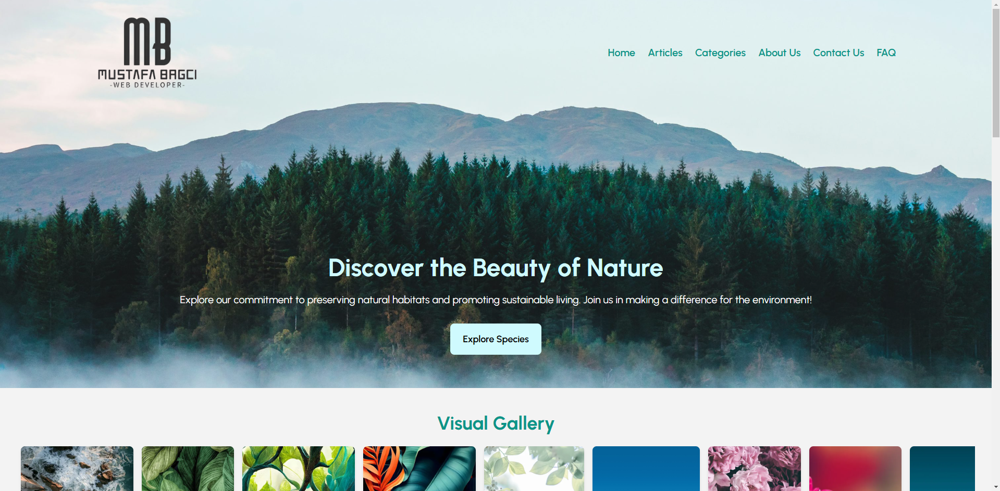

# Educational Website



This project is an educational website built using Next.js. It aims to provide a platform for learning various subjects through interactive content and resources.

## Features

- **Interactive Lessons**: Engaging and interactive lessons on various topics.
- **Responsive Design**: Optimized for different devices and screen sizes.
- **User Authentication**: Secure login and registration system.
- **Content Management**: Easy-to-use interface for managing content.

## Getting Started

To get started with the project, follow these steps:

1. **Clone the repository**:
   ```bash
   git clone https://github.com/mustafa-bagci/educational-website-nextjs.git
   ```
2. **Navigate to the project directory**:
   ```bash
   cd educational-website-nextjs
   ```
3. **Install dependencies**:
   ```bash
   npm install
   ```
4. **Run the development server**:
   ```bash
   npm run dev
   ```

## Technologies Used

- **Next.js**: React framework for server-side rendering and static site generation.
- **React**: JavaScript library for building user interfaces.
- **Node.js**: JavaScript runtime for server-side development.
- **Express**: Web application framework for Node.js.

## Contributing

We welcome contributions to improve the project. To contribute, please follow these steps:

1. Fork the repository.
2. Create a new branch (`git checkout -b feature-branch`).
3. Make your changes.
4. Commit your changes (`git commit -m 'Add some feature'`).
5. Push to the branch (`git push origin feature-branch`).
6. Open a pull request.
